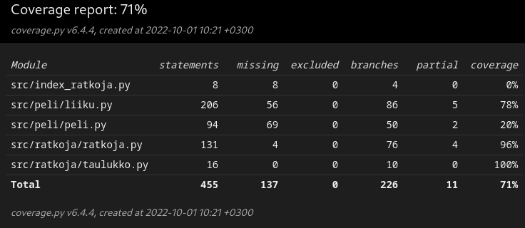

# Testausdokumentti

Ohjelman testaus on toteutettu automatisoiduilla unittesteillä sekä ohjelman suorituskyky suoritetaan manuaalisesti laadituin testein

## Automatisoidut testit

### Pelin testaus

Pelin toimivuudesta vastaava `peli.py`-tiedosto testataan -luokalla. Pelin liikkumisesta vastaava `liiku.py`-tiedosto testataan -luokalla.

### Ratkojan testaaminen

Peli-ratkojasta vastaava `ratkoja.py`-tiedosto testataan -luokalla. 

### Testikattavuus

Tämän hetkinen testikattavuus on 71%

## Suorituskyvyn testaaminen

### Toteutus

Suorituskyvyn testaamista varten ratkoja suoritetaan alusta loppuun ja joka testauskerralla otetaan ylös seuraavat asiat:

- Keskiarvo siirtojen päättämisessä kestäneestä ajasta

- Suurin siirron päättämiseen mennyt aika

- Pienin siirron päättämiseen mennyt aika

- Suurin arvo taulukossa pelin loputtua

Tämä saadaan tehtyä niin, että kun peliä ratkojaa kutsutaan kohteesta , otetaan ylös kulunut aika ja pelin päätyttyä tulokset tulostetaan komentoriville

### Suurin saavutettu arvo

Alla on taulukoitu, että kun pelejä on suoritettu 1 kappaletta, niin kuinka suuren osan ajasta se on päässyt kyseiseen arvoon ja maksimisyvyys on 5

|Saavutettu arvo|2048|4096|8192|16384|
|:-:|:-:|:-:|:-:|:-:|
|Kerrat|1|0|0|0|
|Prosenttina|100%|0%|0%|0%|

### Kulunut aika

Kun testejä on suoritettu 1 kappaletta, niin algoritmilla on mennyt maksimisyvyydellä 5

Vähiten aikaa:

- 1.74e-05 s

Eniten aikaa:

- 0.5056 s

Keskiarvo joka siirtoon:

- 0.10105 s

