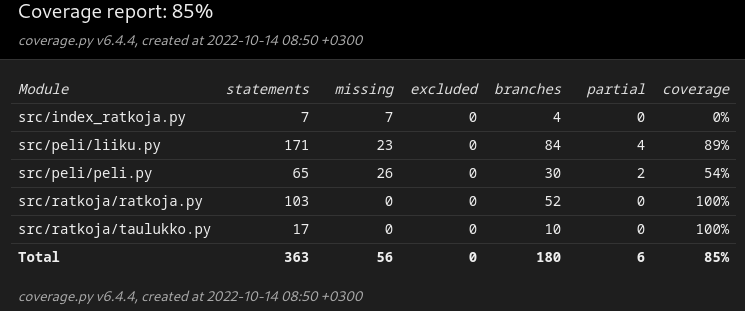

# Testausdokumentti

Ohjelman testaus on toteutettu automatisoiduilla unittesteillä sekä ohjelman suorituskyky suoritetaan manuaalisesti laadituin testein

## Automatisoidut testit

### Pelin testaus

Pelin toimivuudesta vastaava `peli.py`-tiedosto testataan -luokalla. Pelin liikkumisesta vastaava `liiku.py`-tiedosto testataan -luokalla.

### Pelin testauksen toteuttaminen

Liikumisesta vastaavan funktion testaaminen tapahtuu seuraavasti:

- Kaikki siirroista vastaavat funktiot testataan niin, että sille annetaan tietty peliruudukko ja liikuttamalla sitä tiettyyn suuntaan tulisi saada aina tietty taulukko. Esimerkiksi, jos on taulukko, jossa on kaksi 2-laattaa vierekkäin ensimmäisellä rivillä, tulisi saada rivi, jossa on 4-laatta vasemmalla ja muut tyhjiä

- Mahdolliset liikkeet on helppo tarkistaa. On helppo nähdä jostain peliruudukosta, mihin suuntiin siinä voidaan liikkua, joten varmistamalla, että siitä vastaava funktio palauttaa samat suunnat, niin se toimii oikein

### Ratkojan testaaminen

Peli-ratkojasta vastaava `ratkoja.py`-tiedosto testataan -luokalla. 

### Ratkojan testien toteuttaminen

Ratkojan testaaminen on suhteellisen hankalaa pelin satunnaisuuden vuoksi. Kuitenkin, jos katsotaan sitä hyvin pieneltä osalta, voidaan varmistaa sen oikeellisuus annetuilla tiedoilla. Esimerkiksi yhden päätöksen tekeminen tulisi olla aina sama, sillä algoritmin toiminta on determinististä. Jos sille annettaisiin esimerkiksi alla esitetty _Ruudukko 1_, niin se tulee tekemään joka kerta saman päätöksen, vaikka seuraavat siirrot riippuvat syntyneistä palasista.

|||||
|:-:|:-:|:-:|:-:|
|0|0|0|0|
|0|0|2|0|
|0|2|0|0|
|0|0|0|0|

_Ruudukko 1_

Lisäksi ollaan testattu algoritmin toimintaa niin, että on manuaalisesti lisätty uusiin ruudukkoihin laattoja ja varmistettu, että algoritmi tekee ns. oikean päätöksen sen heuristiikan mukaisesti näissä uusissa ruudukoissa. Vaikka testeissä ollaan kutsuttu päätöksiä oikeiksi päätöksiksi, tämä viittaa vain heuristiikan mukaiseen yhteen siirtoon. Satunnaisuuden vuoksi on vaikea sanoa, onko yksi siirto oikeasti oikea vai väärä.

Heuristiikan testaaminen puolestaan on suhteelisen helppoa, laskemalla, että heuristiikka funktio antaa oikean määrän pisteitä kuin mitä ollaan käsin laskettu, voidaan sen varmistaa toimivan oikein.

### Testien ajaminen

Juurihakemistosta kutsumalla seuraavaa komentoa on mahdollista ajaa yksikkö testit

```bash
poetry run invoke test
```

### Testikattavuus

Tämän hetkinen testikattavuus on 85%



## Komentorivi version testaaminen

Komentorivi versiota ei täysin testata automatisoiduin testein, sillä on helpompaa katsoa sen oikeellisuus suorittamalla se.

Joka siirron jälkeen tulostetaan peliruudukko komentoriville. Tästä on nähtävissä, että se ei ole muuttunut erilaiseksi edelliseen siirtoon nähden ja että se tulostuu oikein.

Ratkojan yksikkötesteissä testataan jo valmiiksi, että se palauttaa suunnan oikeassa muodossa. Näin ollen siis suorittamalla komentorivi versio on nähtävissä, että se toimii oikein myös tässä, eli se liikkuu oikeaan suuntaan oikealla tavalla.

## Suorituskyvyn testaaminen

### Toteutus

Suorituskyvyn testaamista varten ratkoja suoritetaan alusta loppuun ja joka testauskerralla otetaan ylös seuraavat asiat:

- Keskiarvo siirtojen päättämisessä kestäneestä ajasta

- Suurin siirron päättämiseen mennyt aika

- Pienin siirron päättämiseen mennyt aika

- Suurin arvo taulukossa pelin loputtua

Tämä saadaan tehtyä niin, että kun peliä ratkojaa kutsutaan kohteesta , otetaan ylös kulunut aika ja pelin päätyttyä tulokset tulostetaan komentoriville. Lisäksi joka suorituskerran jälkeen kirjoitetaan tämä data tiedostoon [ajat.txt](../data/ajat.txt). Täältä pääsee näkemään myös kaikki keräämäni data, jota olen alla käyttänyt


### Suorituskyky testausten ajaminen

Kutsumalla projektin juurihakemistosta seuraavan komennon pystyy pyörittämään pelin internet versiota

```bash
poetry run invoke start
```

Jos haluat testata suorituskykyä komentorivi versiolla, on se mahdollista seuraavalla komennolla

```bash
poetry run invoke ratkoja
```

### Suurin saavutettu arvo

Alla on taulukoitu, että kun pelejä on suoritettu 47 kappaletta, niin kuinka suuren osan ajasta se on päässyt kyseiseen arvoon ja maksimisyvyys on 6

|Saavutettu arvo|512|1024|2048|4096|
|:-:|:-:|:-:|:-:|:-:|
|Kerrat|47|40|24|4|
|Prosenttina|100%|85%|51%|9%|

### Kulunut aika

Kun testejä on suoritettu 1 kappaletta, niin algoritmilla on mennyt maksimisyvyydellä 6

Vähiten aikaa vienyt siirto:

- $1.55*10^-5$ s

Eniten aikaa vienyt siirto:

- 1.69 s

Keskiarvo joka siirtoon:

- 0.324 s
