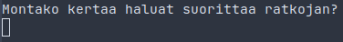

# Käyttöohje

## Ohjelman asentaminen

### Riippuvaisuudet

Ohjelma on riippuvainen seuraavista paketeista

- Python >= 3.10

- Poetry

- Chrome

Poetryn asentaminen onnistuu _pipin_ avulla seuraavasti

```bash
pip install poetry
```

### Release asentaminen

Lataa viimeisimmästä [releasesta](https://github.com/T-Marenk/tiralabra/releases/tag/v1.0.0) tiedosto _2048-ratkoja.zip_. Ladattuasi tiedosto, pura se tietokoneellasi haluamaasi paikkaan.

Purun jälkeen siirry luotuun kansioon _ratkoja_. Kansiossa tiedosto 2048-ratkoja on suoritettava ohjelma.

### Repositorion asentaminen

Kun olet saanut riippuvaisuudet koneellesi asennettua, kloonaa repositorio ja asenna loput ympäristö kohtaiset riippuvuudet poetrylla

1. 
```bash 
git clone https://github.com/T-Marenk/tiralabra
cd tiralabra
```

2. 
```bash
poetry install
```

## Ohjelman suorittaminen

Ohjelmassa on olemassa kaksi eri versiota. Yksi versio pyörittää alkuperäistä [2048 peliä](https://play2048.co/) netissä ja toinen pyörittää paikallista
kopiota pelistä komentorivillä

### Nettiversio

#### Suoritettava tiedosto

Suorita tiedosto 2048-ratkoja _ratkoja_ kansiossa. Ohjelma tulee suorittaa komentoriviltä, sillä ohjelma vaatii komentoriviä suorituksen aikana.

#### Juurihakemistosta suorittaminen

Ohjelman aloitukseksi syötä komentoriville komento

```bash
poetry run invoke start
```

### Käyttäminen

Ohjelma kysyy aluksi, montako kertaa haluat suorittaa ratkojan. Anna vastauksena **positiivinen kokonaisluku**, jonka jälkeen ohjelma pyörittää ratkojan
halutun määrän kertoja



Ohjelman aikana tulostetaan komentoriville kunkin siirron kohdalla kyseiseen siirtoon kulunut aika.

Suoritusten jälkeen ohjelma palauttaa tiedot siitä, mikä oli jokaisen siirron päättämisessä suurin käytetty aika, pienin käytetty aika, keskiarvo päätöksiin
menneestä ajasta sekä mikä oli joka kerralla saavutettu suurin arvo

### Komentoriviversio

Ohjelman suoritukseksi komentoriviltä syötä komento

```bash
poetry run invoke ratkoja
```

Komentorivi versio suoritetaan yhden kerran. Joka siirron kohdalla näytetään siirron päättämiseen kulunut aika, samoin kuin nettiversiossa. Tämän lisäksi komentoriville tulostetaan nykyinen ruudukko.
